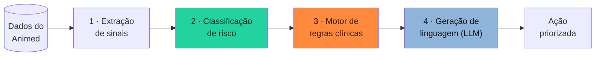
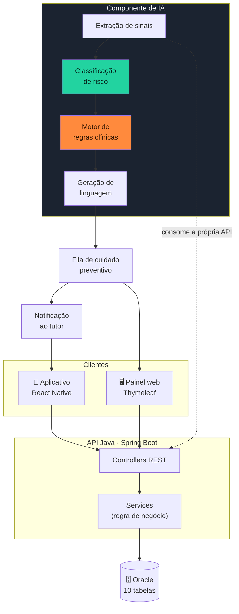

# 🧠 Animed IA — Priorização preventiva do cuidado

Componente de Inteligência Artificial do **Animed**, solução do squad para o Challenge da empresa parceira **Clyvo VET** — FIAP 2026, turma 2TDSR.

> **Disruptive Architectures: IoT, IoB & Generative IA** · Entrega da Sprint 3

---

## 👥 Squad Animed

| Integrante | RM |
|------------|-----|
| Erick Bernardes Bradaschia | 565733 |
| Gabriel Santos Claudino | 564054 |
| Jonathan Moreira Gomes | 565060 |
| Kaiky de Oliveira Silva | 566067 |
| Lucas Fortes de Lima | 559523 |

---

## 🎯 O problema de negócio

A própria Clyvo VET descreveu a dor: a jornada de saúde do pet é **episódica e reativa**. O tutor procura a clínica quando o problema já aconteceu — sintoma agudo, emergência, vacina atrasada — e some entre um evento e outro.

O Animed já ataca isso com gamificação, mas ela tem um limite claro:

> **Trata todo mundo igual.** Manda o mesmo lembrete para quem nunca falta e para quem sumiu há oito meses.

E a clínica tem um limite mais duro: **não consegue ligar para todo mundo**. Com centenas de pacientes, a recepção escolhe a dedo quem chamar — pelo que lembra, não pelo que os dados mostram.

### O que a IA resolve

Identificar, antes que o vínculo se rompa, **quais pets estão saindo do ciclo** e recomendar **a próxima ação para cada um**, ordenada por quanto dano evita. O resultado é uma fila de trabalho: as primeiras ligações do dia são as que mais impedem que um animal adoeça por falta de prevenção.

### Valor para cada lado

| Para quem | O que muda |
|-----------|------------|
| **Tutor** | Recebe o lembrete certo, no momento certo, sobre o que de fato importa para o seu animal — em vez de notificação genérica que ele aprende a ignorar |
| **Pet** | Deixa de adoecer por prevenção esquecida; o atraso vacinal é interceptado antes de virar doença |
| **Clínica** | A agenda deixa de depender da memória da recepção; a ociosidade vira recorrência e o LTV sobe sem prospecção nova |

---

## 🧩 Abordagem de IA adotada

A solução é **híbrida**: três camadas em que cada uma cobre a fraqueza da outra.



### 1. Classificação de risco de evasão

**O que faz:** atribui a cada pet um score de 0 a 100 indicando quanto ele está se afastando do ciclo de cuidado.

**Por que score contínuo:** evasão não é evento, é processo — o tutor não decide abandonar, ele vai adiando. Um score contínuo pega isso enquanto ainda dá para reverter.

**Por que ainda não é modelo treinado:** falta histórico rotulado — não se sabe quais tutores de fato evadiram, e treinar sem isso gera um classificador que decora ruído. O que existe é um **baseline interpretável, calibrado com a clínica**: já entra em produção e vira a linha que o modelo treinado terá de superar.

Em contexto clínico essa ordem importa: um score que o veterinário audita vale mais que um número mais preciso que ninguém sabe explicar.

### 2. Motor de regras clínicas

**O que faz:** sobrepõe ao score as regras que não admitem probabilidade.

**Por que é necessário:** vacina vencida é vacina vencida — se o modelo achar o risco baixo, o animal não fica protegido por isso. A Resolução CFMV nº 1.321/2020 define a vacinação como ato privativo do veterinário, e o sistema não pode relativizar obrigação clínica com estatística.

O motor de regras tem sempre a última palavra sobre **o que** fazer; o modelo decide apenas **em que ordem**.

### 3. Geração de linguagem

**O que faz:** escreve a mensagem que chega ao tutor, no tom adequado ao caso.

**Por que LLM aqui e só aqui:** linguagem é o que modelo generativo faz bem e regra fixa faz mal. "Thor está com a V10 atrasada há 546 dias" e "Notei que faz um tempo que o Thor não vem — a V10 dele venceu" dizem o mesmo com efeito oposto sobre quem lê.

É também onde a LLM é segura: ela **não decide nada**. Recebe os fatos apurados e a ação já escolhida, e só os veste de linguagem — alucinar dosagem ou diagnóstico é impossível porque esses valores nunca são pedidos a ela.

---

## 📊 Dados utilizados

Todos os sinais saem de tabelas que **já existem** no banco. Nenhum dado novo precisa ser coletado — vantagem de o componente nascer depois do produto.

| Sinal | Origem | Como é usado |
|-------|--------|--------------|
| Dias desde o último atendimento | `TB_CONSULTA` (status `REALIZADA`) | Detecta afastamento silencioso |
| Vacinas atrasadas e dias de atraso | `TB_VACINA.DATA_PROXIMA_DOSE` | Maior peso: tem consequência clínica direta |
| Faltas em 12 meses | `TB_CONSULTA` (status `NAO_COMPARECEU`) | Sinaliza desengajamento ativo |
| Cancelamentos em 12 meses | `TB_CONSULTA` (status `CANCELADA`) | Pesa menos: cancelar é mais educado que faltar |
| Taxa de doses no horário | `TB_DOSE_MEDICAMENTO` | Mede adesão real ao tratamento prescrito |
| Tratamentos com doses perdidas seguidas | `TB_MEDICAMENTO` + `TB_DOSE_MEDICAMENTO` | Indica abandono de tratamento em curso |
| Dias desde a última pesagem | `TB_PET.DATA_ULTIMA_PESAGEM` | Sinal mais fraco, porém o mais precoce |
| Consulta agendada para o futuro | `TB_CONSULTA` (status `AGENDADA`) | **Abate** o score: a clínica já agiu |
| Perfil do pet | `TB_PET` | Espécie e idade modulam o calendário vacinal esperado |

### Estrutura e utilização

Os dados são lidos **pela própria API REST** que o aplicativo consome, nunca por exportação manual. O motor enxerga o mesmo estado que o veterinário vê na tela, e toda regra já aplicada na API vale aqui também.

---

## 🏛️ Arquitetura de integração



### Fluxo de dados, ponta a ponta

1. **O tutor e o veterinário usam o sistema** — cada consulta concluída, vacina registrada e dose confirmada vira linha no Oracle
2. **O componente lê a base pela API**, autenticado como perfil clínico, respeitando as mesmas permissões do aplicativo
3. **Os sinais são extraídos** e normalizados em números comparáveis entre animais
4. **O risco é classificado** e as regras clínicas sobrepostas
5. **A fila priorizada** aparece no painel do veterinário e dispara a notificação ao tutor
6. **A ação do tutor realimenta a base** — ele agenda, comparece, o veterinário conclui — e o ciclo recomeça com dado novo

O componente é **desacoplado**: não escreve no banco, não altera regra de negócio e pode ser desligado sem afetar o sistema. Ele observa e recomenda.

---

## ▶️ Como executar

### Pré-requisitos

- Python 3.10 ou superior (usa apenas a biblioteca padrão)
- API do Animed no ar — veja [animed-api](https://github.com/kaiky06301/animed-api)

### Executar a análise

```bash
cd motor
python3 executar.py                      # usa http://localhost:8080
python3 executar.py https://api.exemplo  # outro endereço
```

---

## 📈 Resultados parciais

Execução real sobre a base do Animed em **13/09/2026**, com 9 pacientes cadastrados:

```
FILA DE CUIDADO PREVENTIVO
==============================================================================
 !  1. Mia          score  45  atenção
      tutor: Marina Oliveira Silva
      por quê: 1 vacina em atraso (+25); nunca passou por atendimento
               na clínica (+20); atraso vacinal de 491 dias (+15);
               consulta já agendada (-15)
      ação: Convocar para atualização da carteira de vacinação

 !  2. Thor         score  40  atenção
      tutor: Tutor Demonstração
      por quê: 2 vacinas em atraso (+25); 2 falta(s) em 12 meses (+20);
               4 cancelamento(s) em 12 meses (+10); consulta já agendada (-15)
      ação: Convocar para atualização da carteira de vacinação

    3. Thor         score  25  estável
      tutor: Marina Oliveira Silva
      por quê: 2 vacinas em atraso (+25); atraso vacinal de 547 dias (+15);
               consulta já agendada (-15)
      ação: Convocar para atualização da carteira de vacinação
==============================================================================
9 pacientes analisados: 0 em risco crítico, 2 em atenção, 7 estáveis
```

A saída completa está em [`resultados/execucao-13-09-2026.txt`](resultados/execucao-13-09-2026.txt).

### O que esse resultado mostra

- **A Mia lidera** pelo acúmulo, não por um motivo só: vacina vencida há 491 dias **e** nenhum atendimento registrado. É o perfil que some sem ninguém notar.
- **O Thor da conta de demonstração é o segundo** por desengajamento ativo: além das vacinas, acumula 2 faltas e 4 cancelamentos em 12 meses. Não é esquecimento, é afastamento.
- **O outro Thor cai para terceiro** mesmo com *duas* vacinas atrasadas, porque já existe consulta agendada. O caso está endereçado e não disputa atenção com quem ninguém procurou.
- **Sete estão estáveis** e não precisam de contato. Numa base grande é isso que torna a fila utilizável: ela diz onde *não* gastar esforço.

O abatimento só conta consulta marcada **para frente**. Agendamento vencido que continua em aberto não é cuidado endereçado — é consulta que ninguém resolveu, e descontar por ela esconderia justamente o paciente esquecido.

---

## 🧰 Tecnologias

| Camada | Tecnologia | Por quê |
|--------|-----------|---------|
| Extração e score | Python 3 (biblioteca padrão) | Sem dependência externa: roda em qualquer máquina e em qualquer esteira |
| Fonte de dados | API REST do Animed (Spring Boot) | Mesma fonte do aplicativo, com as mesmas permissões |
| Geração de linguagem | LLM via API (Sprint 4) | Apenas redação da mensagem, nunca decisão clínica |
| Modelo preditivo | scikit-learn (Sprint 4) | Entra quando houver base rotulada para treinar e validar |

---

## 🗺️ O que vem na Sprint 4

Esta entrega **define e documenta** o componente. A implementação completa é a próxima etapa:

- [ ] Treinar o classificador com a base rotulada acumulada e comparar contra este baseline
- [ ] Integrar a camada de linguagem para gerar as mensagens ao tutor
- [ ] Expor a fila priorizada no painel do veterinário
- [ ] Medir o efeito: taxa de retorno dos pacientes contatados contra o grupo não contatado

---

## 🔗 Repositórios do projeto

| Entrega | Repositório |
|---------|-------------|
| API Java | https://github.com/kaiky06301/animed-api |
| Aplicativo Mobile | https://github.com/kaiky06301/animed-app |
| API .NET | https://github.com/kaiky06301/animed-dotnet |

---

## 🎬 Vídeo pitch

**https://youtu.be/7jQUGx2zBrk**

Apresenta o problema de negócio, a justificativa técnica da abordagem híbrida, os dados utilizados, a arquitetura de integração e o resultado sobre a base real.
